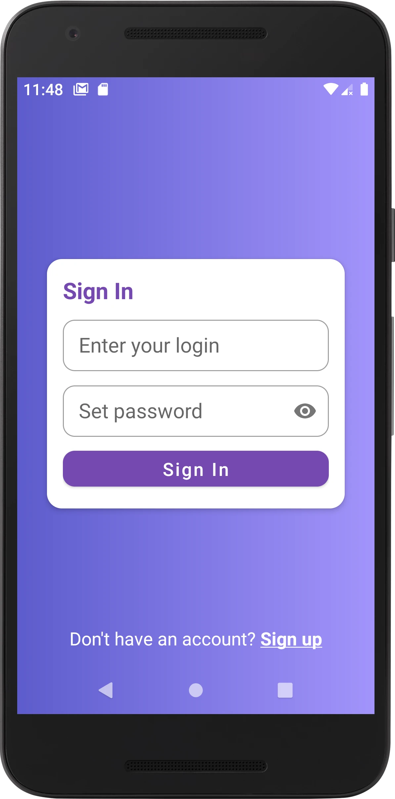
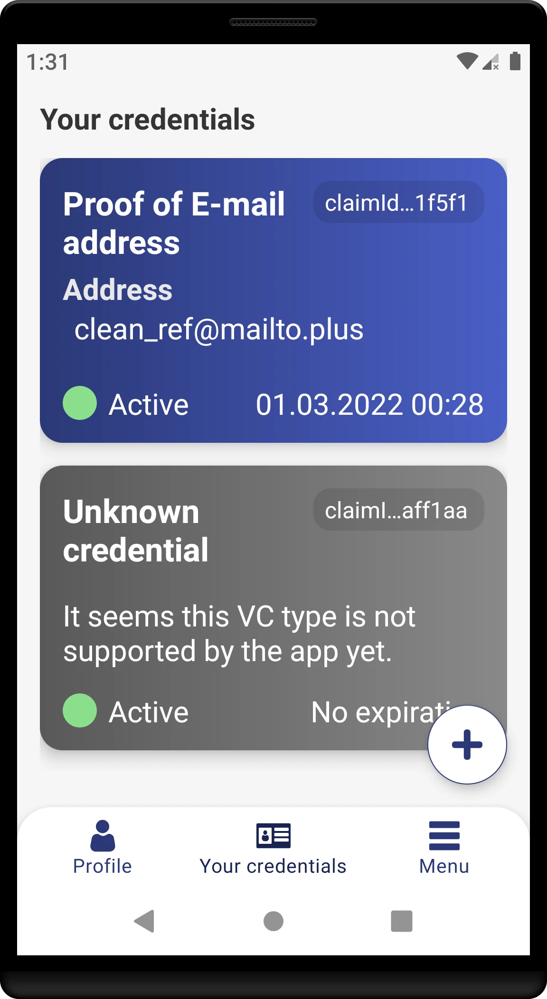
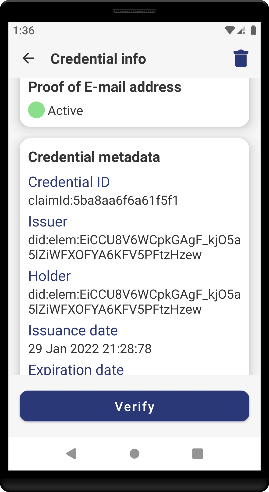
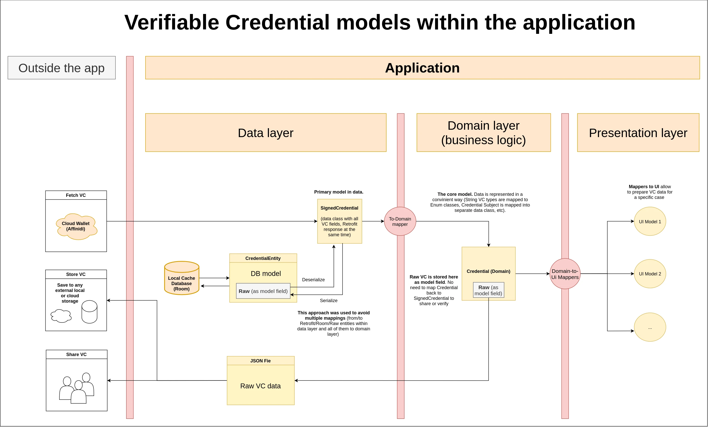

# AffinidiID

* [Description](#description)
* [What is Affinidi Wallet](#what-is-affinidi-wallet)
* [Used APIs](#used-apis)
* [Implemented use cases](#implemented-use-cases)
* [Technical details](#technical-details)
   * [Overveiew](#overveiew)
   * [Schemas](#schemas)

## Description
**AffinidiID** is an android app built for learning purpose. Created to dive into the technical aspects of **Self-Sovereign Identity** and **Verifiable Credentials** [concepts](hhttps://academy.affinidi.com/an-in-depth-exploration-of-self-sovereign-identity-and-verifiable-credentials-1a3eb2296004) using Affinidi open APIs. 
The second objective was to practice with Clean Architecture.
 

## What is Affinidi Wallet
The Affinidi Wallet is a web-based responsive SSI [wallet application](https://wallet.affinidi.com/) for holders to request, store, share and manage their Veriiable Credentials.

## Used APIs
In this application the [Affinidi APIs](https://build.affinidi.com/docs/api) are used to create Affinidi user account and interact with the wallet.

Also [DiceBear Avatars API](https://avatars.dicebear.com/) is used to generate unique avatars depending on the user's DID.

## Implemented use cases
The last version covers the following use cases:

**User profile**
- Sign up
- Sign in
- View profile info (username, DID)
- Change password
- Logout
- Reset password

**Verifiable Credentials**
- Issue credentials
- Store credentials in Affinidi Wallet
- View credentials (list + details)
- Verify credentials
- Delete credentials from Affinidi Wallet

"Edit username" feature was deleted due to API issue. The original name becomes lost immediately after OTP is sent (without confirmation).

## Technical details

### Overview

- Attempts to use clean architecture approach. Presentation / data / domain layers each in a separate module.
- Single activity approach and [Navigation component](https://developer.android.com/guide/navigation) (with SafeArgs) to navigate across fragments.
- Kotlin coroutines for asynchronous operations.
- [Hilt](https://dagger.dev/hilt/) for dependency injection.
- [View binding](https://developer.android.com/topic/libraries/view-binding) is used to interact with views within fragments and recyclerview adapters.
- [ViewBindingPropertyDelegate](https://github.com/androidbroadcast/ViewBindingPropertyDelegate) lib to make work with view binding simplier (avoid boilerplate and safe calls)
- [Retrofit](https://github.com/square/retrofit) for making API requests (plus [OkHttp Logging Interceptor](https://github.com/square/okhttp/tree/master/okhttp-logging-interceptor)).
- [Room](https://developer.android.com/jetpack/androidx/releases/room) for credentials caching.
- [Timber](https://github.com/JakeWharton/timber) for logging.
- [CircleImageView](https://github.com/hdodenhof/CircleImageView) for rounded images, [Coil](https://github.com/coil-kt/coil) to load SVG images into ImageView.

### Schemas

